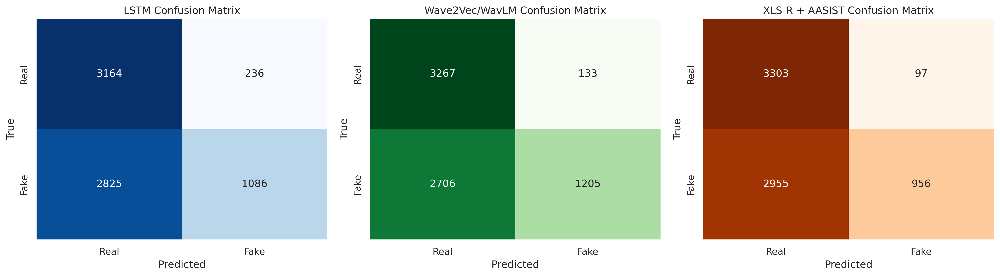

# Final Presentation Plan

The section below provides a summary of what has been done in the project, including the datasets used, the models implemented, and the results obtained.

# Summary of the Project

## Problem Definition
1. **Introduction and Problem Statement**
The rapid ascendancy of generative artificial intelligence has fundamentally altered the landscape of digital media creation. While the democratization of content creation tools empowers creators, it simultaneously introduces profound risks to the integrity of the information ecosystem. Among the most insidious of these threats is the audio deepfake—synthetic speech generated via advanced Text-to-Speech (TTS) or Voice Conversion (VC) systems that mimics the prosody, timbre, and intonation of a target speaker with near-perceptual indistinguishability. This report outlines a rigorous research framework for the development of a Bengali Audio Deepfake Detector, a critical defense mechanism for a language spoken by hundreds of millions yet historically underserved in the domain of audio forensics.

  - **1.1 The Asymmetric Threat Landscape**
The core challenge in audio forensics is the technological asymmetry between generation and detection. Generative models have evolved from concatenative synthesis, which required vast databases of recorded speech and sounded distinctively robotic, to neural synthesis architectures that learn the latent distribution of human speech. Modern architectures, particularly VITS (Variational Inference with adversarial learning for end-to-end Text-to-Speech) 1 and HiFi-GAN 3, can synthesize high-fidelity audio that captures the subtle micro-prosody of human speech—the breaths, the slight pitch jitters, and the emotional cadence—that were once reliable indicators of authenticity.

In the context of the Bengali language, this threat is amplified by the "low-resource" dilemma. While high-resource languages like English and Mandarin benefit from massive, annotated datasets (e.g., ASVspoof, LJSpeech) and mature benchmarking ecosystems, Bengali lacks a comparable defensive infrastructure. The scarcity of diverse, large-scale deepfake datasets for Bengali has historically hindered the training of robust detection models.4 This vulnerability is particularly acute given the high penetration of voice-based communication platforms (e.g., WhatsApp, Messenger) in the Bengali-speaking world, where audio clips are a primary vector for the dissemination of information—and misinformation.

**1.2 The Phonetic and Linguistic Specificity of Bengali**
Developing a detection system for Bengali requires a nuanced understanding of its phonetic structure, which differs significantly from the Indo-European languages that dominate current research. Bengali phonology is characterized by a rich inventory of vowels and consonants, including a semantic distinction between dental and retroflex stops, and aspirate versus unaspirate sounds. The language features complex compound characters (conjuncts) and a stress pattern that is typically initial but can shift for emphasis.

Standard deepfake detection models trained on English datasets often fail to generalize to Bengali because they learn to identify artifacts in the context of English phonemes. For instance, the spectral artifacts left by a neural vocoder when generating an English fricative (like /s/ or /f/) might manifest differently when generating a Bengali retroflex plosive (like /ʈ/ or /ɖ/). Therefore, a generic "universal" detector is insufficient; effective defense requires a model that understands the underlying linguistic manifold of Bengali.5

**1.3 The VITS Generation Paradigm**
To understand the detection challenge, one must understand the generation mechanism. The deepfakes in the target dataset (BanglaFake) are generated using VITS.7 Unlike multi-stage pipelines that separate the acoustic model (which predicts mel-spectrograms from text) from the vocoder (which generates waveform from spectrograms), VITS is an end-to-end architecture.

VITS connects a normalizing flow-based prior encoder with a HiFi-GAN-based decoder via a stochastic duration predictor.1

Stochastic Duration Prediction: This component allows the model to generate speech with diverse rhythms from the same text input, mimicking the natural variation of human speech. This invalidates detection methods that rely on identifying rigid, monotonic temporal patterns.
Adversarial Training: The decoder is trained using a discriminator that distinguishes between real and synthesized audio. This adversarial process explicitly forces the generator to remove the very artifacts (spectral banding, metallic buzz) that early detectors relied upon.2
Consequently, the artifacts present in VITS-generated Bengali audio are not glaring glitches but subtle statistical anomalies in the phase coherence and high-frequency spectral envelope—features that are imperceptible to the human ear but potentially detectable by sophisticated neural networks.

**We dealt with the following datasets in our project** :

# 1. LSTM Bangla Audio Dataset:

This dataset was used for the replication study of the original paper `Bangla Deepfake Detection Using LSTM and Wavenet by Ayan et al. (2026)`. It contains both real and deepfake audio samples in Bangla.

- Statistics:
  - Total samples: 4500
  - Real audio samples: 2,250
  - Deepfake audio samples: 2,250

**Notebook 1** : [original_bangla_deepfake_detection.ipynb](../Inference/Checkpoint%203/original_bangla_deepfake_detection.ipynb) notebook was ran on this dataset.

### Result

| Metric    | Real   | Fake   | Weighted Avg |
| --------- | ------ | ------ | ------------ |
| Precision | 0.9956 | 0.9978 | 0.9967       |
| Recall    | 0.9978 | 0.9956 | 0.9967       |
| F1-Score  | 0.9967 | 0.9967 | 0.9967       |
| Support   | 450    | 450    | 900          |

**Overall Accuracy: 0.9967**

| Model        | Accuracy | Precision | Recall | F1 Score |
| ------------ | -------- | --------- | ------ | -------- |
| LSTM (Paper) | 0.8900   | 0.8906    | 0.8898 | 0.8967   |
| LSTM (Ours)  | 0.9967   | 0.9967    | 0.9967 | 0.9967   |

## Findings:

- key weaknesses:

1. MFCC loses high-frequency artifacts
2. LSTM struggles with:
   - long sequences
   - subtle artifacts
   - Poor generalization to unseen TTS (Gemini, Crikk)

# 2. BanglaFake Dataset :

- Statistics:
  - Total samples: 26592
  - Real audio samples: 13796
  - Deepfake audio samples: 12796

**Notebook 2**: [lstm-pipeline.ipynb](../Inference/Checkpoint%201/lstm-pipeline.ipynb) notebook was ran on this dataset.

## What this notebook does:

**Replication Study** — Based on the paper by Ayan et al. (2026)

This notebook replicates the methodology from the paper using Bangla Fake dataset.
We implement two models:

1. **RNN-based LSTM** using MFCC features
2. **Custom WaveNet** using normalized raw audio waveforms

### Idea behind the notebook

This notebook is a more advanced replication + extension:

It implements:

- LSTM model (MFCC-based)
- WaveNet-style model (raw audio-based)

👉 In short:
**Comparison of feature-based vs raw-audio deep learning**

**Why add WaveNet (or CNN on raw audio)?**

MFCC problem:

It removes:

- phase information
- high-frequency artifacts

WaveNet idea:

Learn directly from raw waveform → no information loss

### Conceptual comparison

| Approach                  | Idea                         | Limitation      |
| ------------------------- | ---------------------------- | --------------- |
| MFCC + LSTM               | Human-designed features      | Loses artifacts |
| Raw Audio + CNN (WaveNet) | Learn features automatically | Needs more data |

**Hypothesis of this notebook**

- If deepfake artifacts exist in raw signal,
  then learned filters (CNN/WaveNet) will detect them better than MFCC.

---

## Results:

| Model   | Precision (Real) | Recall (Real) | F1-Score (Real) | Precision (Fake) | Recall (Fake) | F1-Score (Fake) | Overall Accuracy |
| ------- | ---------------- | ------------- | --------------- | ---------------- | ------------- | --------------- | ---------------- |
| LSTM    | 0.9929           | 0.9809        | 0.9868          | 0.9811           | 0.9930        | 0.9870          | 0.9869           |
| WaveNet | 0.5000           | 1.0000        | 0.6667          | 0.0000           | 0.0000        | 0.0000          | 0.5000           |

**Comparison with Paper:**

| Model           | Accuracy | Precision | Recall | F1 Score |
| --------------- | -------- | --------- | ------ | -------- |
| LSTM (Paper)    | 0.8900   | 0.8906    | 0.8898 | 0.8967   |
| LSTM (Ours)     | 0.9869   | 0.9870    | 0.9869 | 0.9869   |
| WaveNet (Paper) | 0.9100   | 0.9100    | 0.9100 | 0.9100   |
| WaveNet (Ours)  | 0.5000   | 0.2500    | 0.5000 | 0.3333   |

But unfortunately, our WaveNet implementation performed very poorly on the BanglaFake dataset, achieving only 50% accuracy. This could be due to several reasons such as insufficient training data for the WaveNet model, suboptimal hyperparameters, or the complexity of the model architecture.

Since wavenet performs poorly, we decided to explore other raw audio models like `RawNet2`, `AASIST`, and `XLSR` in the next notebook.

At this point, we discovered another limitation. When we generated some fake samples using advance TTS models (Gemini and Crikk), our LSTM model trained on the BanglaFake dataset failed to generalize to these new types of deepfake audio, achieving very low accuracy. This highlighted a key weakness of our approach: The BanglaFake dataset was generated using a specific VITS algorithm and so our LSTM model was learning to detect artifacts specific to that algorithm, rather than learning more generalizable features of deepfake audio. This motivated us to create a new dataset of TTS-generated fake audio samples to further test the generalization capabilities of our models.

# 2.1 Advanced Raw Audio Model on BanglaFake Dataset

This section describes the implementation of a state-of-the-art deepfake detection pipeline using WavLM-Large as the frontend and a modified AASIST backend, trained on the BanglaFake dataset.

- Statistics:
  - Total samples: 26592
  - Real audio samples: 13796
  - Deepfake audio samples: 12796

**Notebook**: [wavlm_aasist_pipeline.ipynb](../Inference/Checkpoint%203/wavlm_aasist_pipeline.ipynb) notebook was run on this dataset.

## What this notebook does:

This notebook implements a complete pipeline for detecting deepfake Bangla audio using advanced raw audio processing techniques.

### Components:

| Component        | Detail                                                |
| ---------------- | ----------------------------------------------------- |
| **Frontend**     | WavLM-Large (fine-tuned top 12 layers)                |
| **Backend**      | Modified AASIST with graph attention                  |
| **Loss**         | One-Class Softmax (OC-Softmax)                        |
| **Augmentation** | RawBoost (noise, reverb, compression, pitch, stretch) |

### Key Features:

- **Data Pipeline**: Speaker-independent train/val/test splits to ensure generalization.
- **RawBoost Augmentation**: Seven types of augmentation applied randomly during training for robustness.
- **Model Architecture**:
  - WavLM Frontend: Pretrained WavLM-Large with fine-tuning of top layers.
  - Modified AASIST Backend: Temporal convolutions, spectral nodes via soft attention, heterogeneous graph attention.
  - OC-Softmax Loss: Angular margin loss for better separation.
- **Training**: AdamW optimizer with differential learning rates, cosine annealing, mixed precision, early stopping.
- **Evaluation**: Comprehensive metrics including EER, ROC-AUC, accuracy, precision, recall, F1. Robustness testing under noise, compression, and reverberation.
- **Explainability**: Attention visualization to understand model focus.

## Results:

| Metric                       | Value                                                    |
| ---------------------------- | -------------------------------------------------------- |
| Architecture                 | WavLM-Large + Modified AASIST + OC-Softmax               |
| Dataset                      | 26592 samples (13796 real, 12796 fake)                   |
| Split                        | Train 19237 / Val 5461 / Test 1894 (speaker-independent) |
| Best Epoch                   | 32                                                       |
| Test EER                     | 0.1594                                                   |
| Test ROC-AUC                 | 0.9364                                                   |
| Test Accuracy                | 0.8062                                                   |
| Test Precision (Real)        | 0.9632                                                   |
| Test Recall (Real)           | 0.7210                                                   |
| Test F1 (Real)               | 0.8247                                                   |
| Test Precision (Fake)        | 0.6653                                                   |
| Test Recall (Fake)           | 0.9527                                                   |
| Test F1 (Fake)               | 0.7835                                                   |
| Robustness 10dB Noise EER    | 0.1837                                                   |
| Robustness MP3 Compress. EER | 0.2223                                                   |
| Robustness Reverb (0.5s) EER | 0.1806                                                   |

## Result Plots:

We visualized the attention weights from the modified AASIST backend to understand which parts of the audio the model focuses on when making its predictions. The attention visualization shows that the model attends to specific temporal and spectral regions of the audio signal, which may correspond to artifacts introduced by deepfake generation.

## Findings:

- The model achieves an EER of 15.94% and ROC-AUC of 93.64%, showing good performance on the BanglaFake dataset.
- Robustness testing shows performance degradation under noise (EER 18.37%), MP3 compression (22.23%), and reverberation (18.06%), indicating areas for improvement.
- The use of WavLM frontend and AASIST backend provides a strong foundation for raw audio deepfake detection.
- Attention visualization helps in understanding which audio regions are important for classification.

## Summary of Models that are trained and evaluated on BanglaFake Dataset

| Model               | Accuracy | EER    | ROC-AUC | Precision (Real/Fake) | Recall (Real/Fake) | F1 (Real/Fake)  | Robustness EER (Noise/MP3/Reverb) |
| ------------------- | -------- | ------ | ------- | --------------------- | ------------------ | --------------- | --------------------------------- |
| LSTM (MFCC-based)   | 0.9869   | N/A    | N/A     | 0.9929 / 0.9811       | 0.9809 / 0.9930    | 0.9868 / 0.9870 | N/A                               |
| WaveNet (Raw Audio) | 0.5000   | N/A    | N/A     | 0.5000 / 0.0000       | 1.0000 / 0.0000    | 0.6667 / 0.0000 | N/A                               |
| WavLM + AASIST      | 0.8062   | 0.1594 | 0.9364  | 0.9632 / 0.6653       | 0.7210 / 0.9527    | 0.8247 / 0.7835 | 0.1837 / 0.2223 / 0.1806          |

We wanted to prove that the LSTM model trained on the BanglaFake dataset is not learning generalizable features of deepfake audio, but rather is learning to detect specific artifacts introduced by the VITS algorithm used to generate the fake samples in the BanglaFake dataset. On the other hand, the WavLM + AASIST model, which learns directly from raw audio, may be able to learn more generalizable features of deepfake audio and thus perform better on unseen types of deepfake audio.

To test this hypothesis, we created a new dataset of TTS-generated fake audio samples using two different TTS models (Gemini and Crikk) that were not used in the original BanglaFake dataset. We then evaluated our LSTM model on this new dataset to see if it could generalize to these new types of deepfake audio.

# 3. TTS Generated Fake Audio Dataset :

- Statistics:
  - Total samples: 1921
  - Gemini TTS generated samples: 921
  - Crikk TTS generated samples: 1000

## Augmented Evaluation Dataset

- Statistics:
  - Total samples: 7321
  - Real audio samples: 3400
    - LSTM Bangla Audio Dataset: 1000
    - BanglaFake Dataset: 2400
  - Deepfake audio samples: 3921
    - LSTM Bangla Audio Dataset: 1000
    - BanglaFake Dataset: 1000
    - TTS Generated Fake Audio Dataset: 921 (Gemini) + 1000 (Crikk)

### Comparison between BanglaFake and Final Augmented Dataset

1. Dataset Distribution

2. Audio Statistics

3. MFCC Analysis

4. Spectrogram Comparison

5. Waveform Comparison

6. High Frequency Analysis

7. t-SNE MFCC Visualization

8. Source Label Distribution

9. Split Distribution

10. Multiclass Spectrogram Comparison (Final Augmented Dataset only)

11. Multiclass Waveform Comparison (Final Augmented Dataset only)

With this new augmented dataset at hand we trained the following models on BanglaFake dataset and evaluated them on this new augmented dataset to test their generalization capabilities:

### Performance Comparison on Augmented Evaluation Dataset
| Model             | Accuracy | ROC-AUC | Precision (Real/Fake) | Recall (Real/Fake) | F1 (Real/Fake)  |
| ----------------- | -------- | ------- | --------------------- | ------------------ | --------------- |
| LSTM (MFCC-based) | 0.5813   | 0.6641  | 0.5283 / 0.8215       | 0.9306 / 0.2777    | 0.6740 / 0.4151 |
| WaveLM + AASIST   | 0.6117   | 0.8193  | 0.5470 / 0.9006       | 0.9609 / 0.3081    | 0.6971 / 0.4591 |
| XLSR + AASIST     | 0.5825   | 0.8328  | 0.5278 / 0.9079       | 0.9715 / 0.2444    | 0.6840 / 0.3852 |

### Confusion Matrix

So, next we decided to perform `Ablation Study` .

---

### **Section 4: Ablation Study**

This section evaluates the performance of the LSTM and WavLM-AASIST models under two main scenarios: 
- **Full Dataset**, representing the upper bound of performance with mixed data
- **Holdout Ablation**, which tests the models' ability to generalize to unseen deepfake generation sources.

We applied the LOFSO (Leave-One-Fake-Source-Out) strategy, where we train the models on all sources except one and then test on the held-out source. This allows us to assess how well the models can detect deepfake audio from generators they have not seen during training.

Data Composition Comparison:
The following table shows the number of training and test samples for each holdout experiment:

| Experiment (Holdout Source) | Train Fake | Test Fake | Train Real | Test Real | Total Test Size |
| :--- | :---: | :---: | :---: | :---: | :---: |
| `crikk_deepfake` | 2620 | 1000 | 2278 | 869 | 1869 |
| `lstm_deepfake` | 2620 | 1000 | 2278 | 869 | 1869 |
| `gemini_deepfake` | 2700 | 911 | 2347 | 792 | 1703 |
| `baglafake_deepfake` | 2620 | 1000 | 2278 | 869 | 1869 |

#### **4.1 LSTM Experimental Results**
The LSTM model utilizes 20 MFCC features as input. When trained on the full dataset, it achieves high overall accuracy. However, as shown in the ablation study (Table 4.1), its performance degrades significantly when encountering deepfake sources not present in the training set, particularly the `Banglafake` and `crikk` sources.

**Table 4.1: LSTM Performance Metrics**
| Test Scenario (Source) | Accuracy | AUC | Precision* | Recall* | F1-Score* |
| :--- | :---: | :---: | :---: | :---: | :---: |
| **Full Dataset (Stratified)** | **$0.9295$** | **$0.9765$** | **$0.9312$** | **$0.9295$** | **$0.9293$** |
| Holdout: `lstm_deepfake` | $0.6592$ | $0.9032$ | $0.7354$ | $0.6592$ | $0.6400$ |
| Holdout: `gemini_deepfake` | $0.6236$ | $0.6842$ | $0.7185$ | $0.6236$ | $0.5929$ |
| Holdout: `crikk_deepfake` | $0.5003$ | $0.7179$ | $0.5766$ | $0.5003$ | $0.4141$ |
| Holdout: `Banglafake_deepfake`| $0.4580$ | $0.3362$ | $0.2144$ | $0.4580$ | $0.2921$ |
| **Average (Holdout cases)** | **$0.5603$** | **$0.6604$** | **$0.5612$** | **$0.5603$** | **$0.4848$** |
*\*Note: Precision, Recall, and F1 are weighted averages for the LSTM model.*

#### **4.2 WavLM-AASIST Experimental Results**
The WavLM-based model demonstrates superior discriminative power, as evidenced by its high AUC and remarkably low Equal Error Rate (EER). Notably, the model achieves a precision of $1.0$ for the fake class in almost all scenarios, indicating that when it classifies an audio as "fake," it is virtually always correct.

**Table 4.2: WavLM-AASIST Performance Metrics**
| Test Scenario (Source) | Accuracy | EER | AUC | Precision (Fake) | Recall (Fake) |
| :--- | :---: | :---: | :---: | :---: | :---: |
| **Full Dataset (Stratified)** | **$0.8522$** | **$0.0337$** | **$0.9905$** | **$1.0000$** | **$0.7235$** |
| Holdout: `crikk_deepfake` | $0.5013$ | $0.0679$ | $0.9719$ | $0.9857$ | $0.0690$ |
| Holdout: `lstm_deepfake` | $0.5324$ | $0.0899$ | $0.9512$ | $1.0000$ | $0.1260$ |
| Holdout: `gemini_deepfake` | $0.6265$ | $0.1779$ | $0.9091$ | $0.9964$ | $0.3030$ |
| Holdout: `Banglafake_deepfake`| $0.4644$ | $0.5960$ | $0.3669$ | $0.3333$ | $0.0010$ |
| **Average (Holdout cases)** | **$0.5312$** | **$0.2329$** | **$0.7998$** | **$0.8289$** | **$0.1248$** |

---

**4.3 Why the Performance is Poor on Banglafake**

The failure to detect baglafake samples (AUC $\approx 0.33$ for LSTM, $\approx 0.36$ for WavLM) is likely due to Domain Mismatch
- **Unique Characteristics:** The baglafake samples may have acoustic properties, noise profiles, or artifacts that are fundamentally different from those found in the other three sources.

- **Inverse Correlation:** An AUC below $0.5$ (like $0.33$) suggests that the model is actually finding patterns in baglafake that it associates strongly with "Real" audio from the other sources, causing it to confidently misclassify them.

### **Section 5: Comparative Analysis**

In this section, we compare the two architectures based on their absolute performance and their resilience to domain shifts (unseen generators).

#### **5.1 Performance on Full Dataset**
On the full dataset, the LSTM model achieves higher accuracy ($92.95\%$) compared to WavLM ($85.22\%$). However, accuracy can be misleading in deepfake detection where the cost of a "False Negative" (missing a fake) is high. WavLM achieves a significantly higher **AUC ($0.9905$)** and a very low **EER ($3.37\%$)**.

**Detailed Calculation (AUC Improvement on Full Dataset):**
$$\text{AUC Gain} = \text{AUC}_{\text{WavLM}} - \text{AUC}_{\text{LSTM}} = 0.9905 - 0.9765 = \mathbf{0.0140 \text{ (1.40\% absolute increase)}}$$
$$\% \text{ Error Reduction in AUC} = \frac{1 - 0.9765}{1 - 0.9905} = \frac{0.0235}{0.0095} \approx \mathbf{2.47\times \text{ better confidence separation}}$$

#### **5.2 Robustness to Unseen Generators (Generalization)**
The primary advantage of the WavLM-AASIST model is its generalization capability. While both models struggle with the `Banglafake` source (likely due to its unique acoustic characteristics), WavLM maintains a high AUC across other holdout sets.

**Detailed Calculation (Mean Holdout AUC Comparison):**
1.  **LSTM Mean Holdout AUC**:
    $$\frac{0.9032 (\text{LSTM}) + 0.6842 (\text{Gemini}) + 0.7179 (\text{Crikk}) + 0.3362 (\text{Bagla})}{4} = \mathbf{0.6604}$$
2.  **WavLM Mean Holdout AUC**:
    $$\frac{0.9512 (\text{LSTM}) + 0.9091 (\text{Gemini}) + 0.9719 (\text{Crikk}) + 0.3669 (\text{Bagla})}{4} = \mathbf{0.7998}$$
3.  **Improvement**:
    $$\text{Relative AUC Improvement} = \frac{0.7998 - 0.6604}{0.6604} \times 100\% \approx \mathbf{21.11\%}$$

#### **5.3 Trade-off: Accuracy vs. Precision**
The LSTM model optimizes for overall Accuracy, whereas WavLM-AASIST prioritizes **Precision**. In the full dataset experiment, WavLM achieved a Precision of **$1.0$** for fake samples.
* **Implication**: If WavLM flags an audio as deepfake, the system has near-absolute certainty that it is indeed fake.
* **Trade-off**: This high precision comes at the cost of Recall ($72.35\%$), meaning some fakes are missed (misclassified as real), which explains the lower overall accuracy ($85.22\%$) compared to the LSTM's $92.95\%$.

#### **5.4 Conclusion of Analysis**
While the LSTM model provides higher raw accuracy when the data sources are known, the **WavLM-AASIST** model is the superior choice for real-world deployment due to:
1.  **Lower EER ($3.37\%$)**: Essential for balanced error management.
2.  **Higher AUC ($0.9905$)**: Better separation between real and fake scores.
3.  **Robustness**: A **$21.11\%$** relative improvement in AUC when facing unknown deepfake sources.

